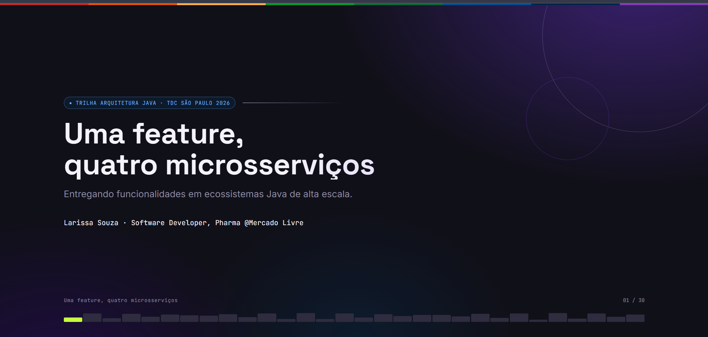

# Palestra: Uma feature, quatro microsserviços

Esse repositório os materiais (slides e demo interativa) utilizados na palestra **"Uma feature, quatro microsserviços: Entregando funcionalidades em ecossistemas Java de alta escala"**, apresentada por Larissa Souza na "Trilha Arquitetura Java" do TDC São Paulo 2026.

A talk mostra como uma tela aparentemente simples — a confirmação de compra de um marketplace — atravessa uma arquitetura reativa com Server-Driven UI (SDUI), e como um detalhe de `Mono.zip()` no fan-out de 7 fontes de dados pode derrubar a tela inteira. O material cobre programação reativa, as camadas do ecossistema, o ciclo de vida de uma requisição, feature flags e o processo de review/deploy.

## 📸 Preview

| Slides |
|---|
|  |

| Demo interativa |
|---|
|  |


## 📁 Estrutura do repositório

```
tdc2026-uma-feature-quatro-microsservicos/
├── index.html      # Slides da apresentação
├── demo.html        # Demo interativa: bug e fix do Mono.zip()
├── screenshots/
│   ├── slides-preview.png
│   └── demo-preview.png
└── README.md
```

## 🖥️ Rodando localmente

Como são arquivos HTML estáticos (sem build step), basta abrir direto no navegador ou servir localmente:

```bash
# opção 1: abrir direto
open index.html

# opção 2: servidor local simples
python3 -m http.server 8000
# depois acesse http://localhost:8000
```

## 🎨 Sobre o material

- Totalmente responsivo (desktop e mobile), com navegação por swipe/toque e setas flutuantes nos slides.
- Identidade visual com a paleta oficial da TDC aplicada em detalhes (faixa no topo, bordas, eyebrows).
- Demo com diagrama de fan-out paralelo (7 fontes → `Mono.zip()`), JSON emitido pelo middleend (SDUI) e comparação lado a lado entre a versão com bug (`Mono.empty()`) e a versão corrigida (`Mono.just()` com objeto vazio).

## 📝 Licença

© Feito com ❤ por Lary Souza -> Material de apresentação para o TDC São Paulo 2026.
